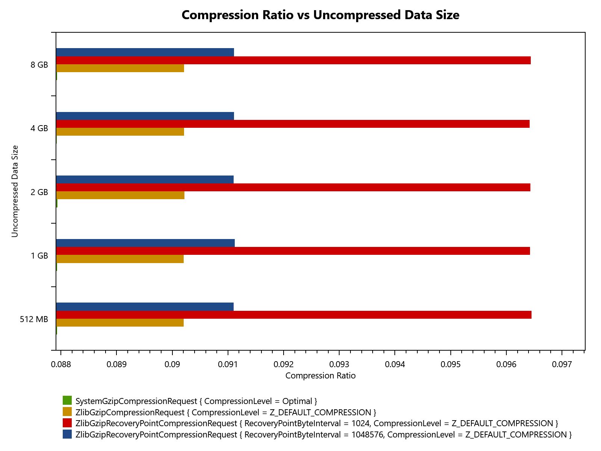
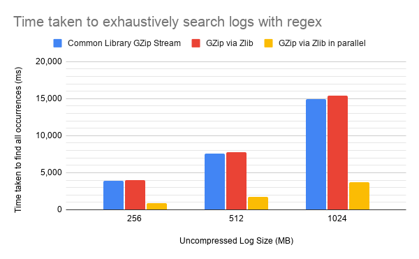

[//]: # (https://www.markdownguide.org/basic-syntax/#reference-style-links)

[![.NET][DotNet]][DotNet-url][![LinkedIn][linkedin-shield]][linkedin-url]


<!-- PROJECT LOGO -->
<br />
<div align="center">
  <h3 align="center">ZLib Random Access</h3>

  <p align="center">
    Exploring a feature of the ZLib Library
<!--
    <br />
    <a href="https://github.com/othneildrew/Best-README-Template"><strong>Explore the docs »</strong></a>
-->
    <br />
    <br />
    <a href="https://github.com/othneildrew/Best-README-Template">View Benchmarks</a>
<!--
    &middot;
    <a href="https://github.com/othneildrew/Best-README-Template/issues/new?labels=bug&template=bug-report---.md">Report Bug</a>
    &middot;
    <a href="https://github.com/othneildrew/Best-README-Template/issues/new?labels=enhancement&template=feature-request---.md">Request Feature</a>
-->
  </p>
</div>

<!-- TABLE OF CONTENTS -->
<details>
  <summary>Table of Contents</summary>
  <ol>
    <li>
      <a href="#about-the-project">About The Project</a>
      <ul>
        <li><a href="#built-with">Built With</a></li>
      </ul>
    </li>
    <li>
      <a href="#performance">Performance</a>
    </li>
    <li>
      <a href="#getting-started">Getting Started</a>
      <ul>
        <li><a href="#prerequisites">Prerequisites</a></li>
        <li><a href="#benchmarking">Running the Benchmarks</a></li>
      </ul>
    </li>
    <li><a href="#usage">Usage</a></li>
    <li><a href="#roadmap">Roadmap</a></li>
    <li><a href="#acknowledgments">Acknowledgments</a></li>
  </ol>
</details>

<!-- ABOUT THE PROJECT -->
## About The Project

[//]: # (TODO: Add a screen shot of the final UI)
[//]: # ([![Product Name Screen Shot][product-screenshot]]&#40;https://example.com&#41;)

This project is about exploring a particular feature of the ZLib libarary - the ability to fully reset the compression algorithm. This is called the 'Full Flush' and this particular kind of flush is not typically available to use. The .NET BCL class for writing GZip files does not expose this functionality.

'Full Flush' allows us to start decompressing whereever it was done.

<p align="right">(<a href="#readme-top">back to top</a>)</p>


### Built With

* [.NET][DotNet-url]
* [BenchmarkDotNet][BenchmarkDotNet-url]
* [CsvHelper][CsvHelper-url]

<p align="right">(<a href="#readme-top">back to top</a>)</p>

<!-- Performance -->
## Performance

I benchmarked the trade-offs (file size vs access speed) of the 'full-flush' approach by compressing some sample logs.

The logs are generated by the `LogSimulator` project and resemble the output of a ficticious RPG.

### Compression Ratio
Fully resetting the compression algorith degrades the compression ratio. However the degredation is not that much.



### Enabling Parallel Search

Being able to decompress from each 'full flush' allows us to search from all such locations in parallel. The perfomance gain here is significant.



<!-- GETTING STARTED -->
## Getting Started

These are instructions for running the project locally.

### Prerequisites

* windows
* [dotnet 10 SDK][DotNet-download-url]

### Benchmarking

_Below is an example of how you can instruct your audience on installing and setting up your app. This template doesn't rely on any external dependencies or services._

1. Clone the repo
   ```
   git clone https://github.com/SamuelSalam815/ZLibRandomAccess.git
   ```
2. Build the solution
   ```
   dotnet build -c Release
   ```
3. Run the speed benchmarks
   ```
   dotnet run --project Benchmarking.TextSearch\
   ```
4. Run the compression ratio benchmarks
   ```
   dotnet run --project Benchmarking.CompressionRatio\
   ```

<p align="right">(<a href="#readme-top">back to top</a>)</p>

<!-- USAGE EXAMPLES -->
## Usage

In additon to reading and searching text files as if they were not compressed, this technique also allows more data to be recovered from a compressed file if it happens to be corrupted. If one segment contains corrupt data, one could potentially recover all the other segments since they are compressed independently.

In practice a well-managed stack like [ELK](https://www.elastic.co/elastic-stack) is more appropriate for logs. Even on a smaller scale, simply writing a new log file once a file gets beyond some arbtrary limit is a simpler solution.

<p align="right">(<a href="#readme-top">back to top</a>)</p>

<!-- ROADMAP -->
## Roadmap

- [x] Write C# bindings for ZLib
- [x] Verify correct use of ZLib
- [x] Benchmark random access
- [x] Add a user interface for generating compressed files
  - [ ] Add feature to compress new/recomrpess old files
- [ ] Investigate the use of a modern WPF style and/or control library
- [ ] Add a user interface for browsing compressed text files with random access

<p align="right">(<a href="#readme-top">back to top</a>)</p>

<!-- LICENSE -->
## License

Distributed under the Unlicense License. See `LICENSE.txt` for more information.

<p align="right">(<a href="#readme-top">back to top</a>)</p>


<!-- ACKNOWLEDGMENTS -->
## Acknowledgments

Use this space to list resources you find helpful and would like to give credit to. I've included a few of my favorites to kick things off!

* [THE Best ReadMe template](https://github.com/othneildrew/Best-README-Template)
* [Google Sheets](https://workspace.google.com/intl/en_uk/products/sheets/)
* [Choose an Open Source License](https://choosealicense.com)
* [Img Shields](https://shields.io)

<p align="right">(<a href="#readme-top">back to top</a>)</p>


<!-- MARKDOWN LINKS & IMAGES -->
<!-- https://www.markdownguide.org/basic-syntax/#reference-style-links -->
[ZLib-url]: https://zlib.net/
[linkedin-shield]:https://img.shields.io/badge/-LinkedIn-black.svg?style=for-the-badge&logo=linkedin&colorB=555
[linkedin-url]: https://www.linkedin.com/in/samuel-salam-07b050251/
[DotNet]: https://img.shields.io/badge/.NET-%235C2D91.svg?style=for-the-badge&logo=.net&logoColor=white
[DotNet-url]: https://dotnet.microsoft.com/en-us/
[DotNet-download-url]: https://dotnet.microsoft.com/en-us/download
[BenchmarkDotNet-url]: https://benchmarkdotnet.org/index.html
[CsvHelper-url]: https://joshclose.github.io/CsvHelper/
